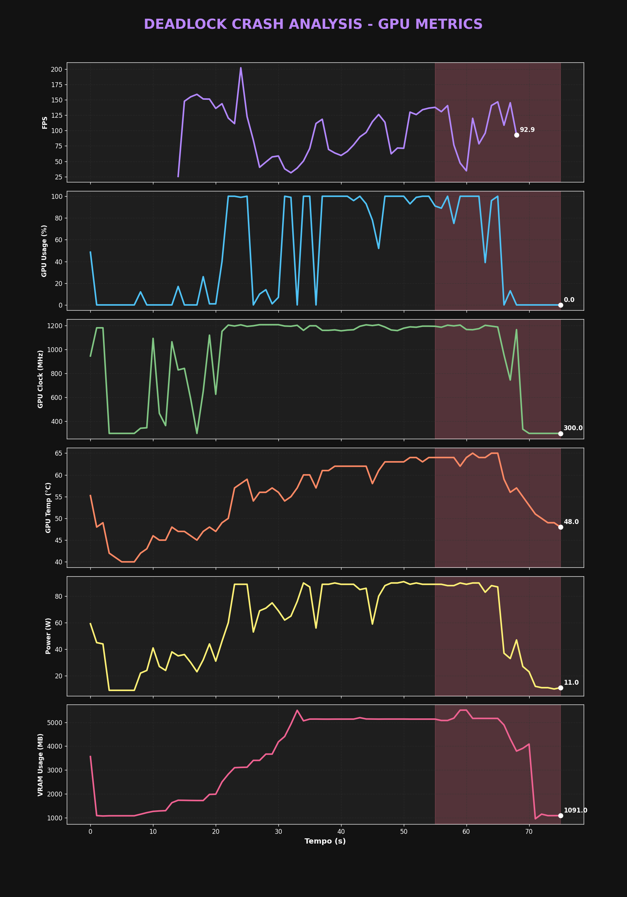

# 🎮 Deadlock Crash Analyst: A GPU & System Diagnostics Case Study


## 🚀 Overview
Welcome to the **Deadlock Crash Analyst** project. This repository documents a deep-dive investigation into recurring game crashes in Valve's *Deadlock*. What started as a suspected GPU failure turned into a fascinating data science exercise, proving that numbers often tell a much more complex story than a simple "black screen" suggests.

## 🔍 The Mystery
**The Symptom:** Every time the game finds a match, the user is ejected to the desktop. No error messages, no "AMD Bug Report", and a mysterious absence of entries in the Windows Event Viewer. 

**The Suspect:** An AMD GPU (RX Series). Initial theories pointed towards overheating or driver instability during the intensive shader compilation and map loading that occurs when transitioning from the menu to a match.

## 🛠️ The Investigative Toolkit
To solve this mystery, we used a robust set of diagnostic and analysis tools:
- **AMD Software: Adrenalin Edition:** Used to capture high-frequency raw performance logs (`.csv`).
- **Python (3.13):** The engine for data processing.
- **Pandas:** Used for data cleaning, mapping Portuguese metric names to a standard schema, and handling missing values (`N/A`).
- **Matplotlib/Seaborn:** Used to generate high-fidelity temporal visualizations to see exactly what happened in the milliseconds before the crash.
- **System Internals:** Windows Event Viewer (used to rule out OS-level crashes).

## 📈 Data Acquisition & EDA
The raw data was extracted from a 78-second recording session that captured a crash event. Our Exploratory Data Analysis (EDA) revealed some surprising initial statistics:
- **GPU Temp:** Maxed at 65°C (Well within safe limits).
- **GPU Usage:** Peaked at 100%, but dropped to 0% right before the logging stopped.
- **CPU Usage:** Dangerously high, reaching **98.97%**.
- **System RAM:** Reached **15.4 GB**, indicating a near-exhaustion of available system memory (on a 16GB system).

## 🧩 The Crucial Visualization - Interpreting the Crash
The heart of our investigation lies in the temporal analysis of the metrics.



### Explaining the Plot
The visualization above splits the system's vital signs into six synchronous subgraphs. Each axis shares the same timeline (seconds):

- **FPS & GPU Usage:** Show a healthy game state (~140 FPS) until the **65-second mark**.
- **Zona Pré-Crash (Últimos 20s):** Highlighted in the red shaded area, we see a dramatic divergence. 
- **The Anomaly:** At exactly **t=66s**, while the game is attempting to load the match, the **GPU Usage and Clock drop abruptly to near-zero**. This is the classic signature of a software hang where the GPU is waiting for data that never arrives from the CPU/Memory.


## 💡 The "Aha!" Moment & Root Cause
By correlating the GPU drop with our system-wide metrics, we found the true culprit:
1. **CPU Saturation (99%):** During match loading, the CPU became the bottleneck, unable to feed the GPU.
2. **RAM Exhaustion (15.4 GB):** On a 16GB RAM system, hitting 15.4GB of usage (committed) is a critical failure point. 

**Conclusion:** The crash wasn't a GPU "failure" but a **System Out-of-Memory (OOM) / CPU Hang**. The OS likely terminated the *Deadlock* process to preserve system stability as the memory reached 100% capacity during map transition.

## ✅ The Fix & Optimization
To resolve these crashes, we applied the following strategy:
- [x] **Pagefile Adjustment:** Increased the Windows Pagefile (Virtual Memory) to handle the 16GB+ spikes during loading.
- [x] **FPS Capping:** Limited the menu FPS to 60 to reduce CPU/GPU load during matchmaking transitions.
- [x] **Process Hygiene:** Closed high-memory background applications (Browsers/Discord) before launching the game.
- [x] **Graphic Tuning:** Reduced "Texture Quality" slightly to lower the VRAM/System RAM footprint during map loading.

## 📚 Key Learnings
- **Correlation ≠ Causation:** Just because the screen goes black doesn't mean the GPU is at fault.
- **Holistic Monitoring:** Always log System RAM and CPU usage alongside GPU metrics; they are often the silent killers.
- **Context Matters:** Transitions (menus to matches) are the most volatile moments for system stability.

## 📂 Repository Structure
```text
deadlock-crash-analysis/
├── data/
│   └── 20260207-020420.CSV        # Raw AMD Adrenalin log file
├── images/
│   └── deadlock_crash_analysis.png # Generated analysis visualization
├── src/
│   └── analyze_gpu.py             # Python script for data processing & plotting
├── README.md                      # Project documentation
└── .gitignore                     # Git exclusion rules
```

## 🤝 How to Contribute or Replicate
If you are experiencing similar crashes in *Deadlock* or other Source 2 engine games:
1. Enable **Performance Logging** in your GPU driver (AMD Adrenalin or NVIDIA FrameView).
2. Run the script provided in `src/analyze_gpu.py` against your `.csv` file.
3. Replace the `file_path` variable with your local path.

```python
import pandas as pd
# Load your own data
df = pd.read_csv('your_log_file.csv', na_values='N/A')
# Run analysis...
```

---
**Found this useful?** Let's connect on [LinkedIn](https://www.linkedin.com/in/isaquerr/) or open an Issue here to discuss Source 2 optimization! 🚀
